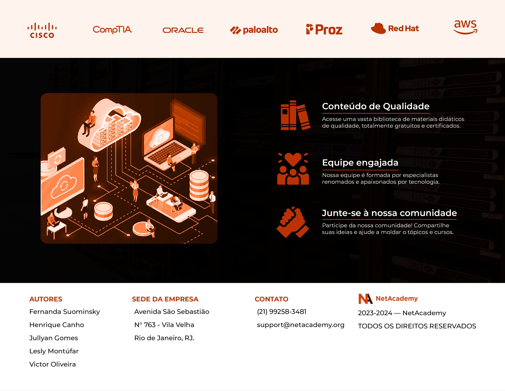
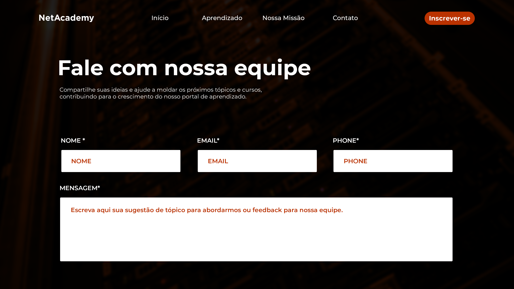

# Projeto-talento-Cloud-Pro

## Table of contents

- [Overview](#overview)
  - [The Project](#the-project)
  - [Screenshot](#screenshot)
  - [Links](#links)
- [Process](#my-process)
  - [Built with](#built-with)

## Overview

### The Project

It's a simple site for teaching computer networking.

### Links

- Live Site URL: [Netlify](https://66c9ac93d921d3bc5d7a7ecb--loquacious-quokka-3e1d21.netlify.app/)

### Screenshot

### Built with

- Semantic HTML5 markup
- CSS custom properties
- Flexbox
- Desktop-first workflow
- Interactive elements with Javascript